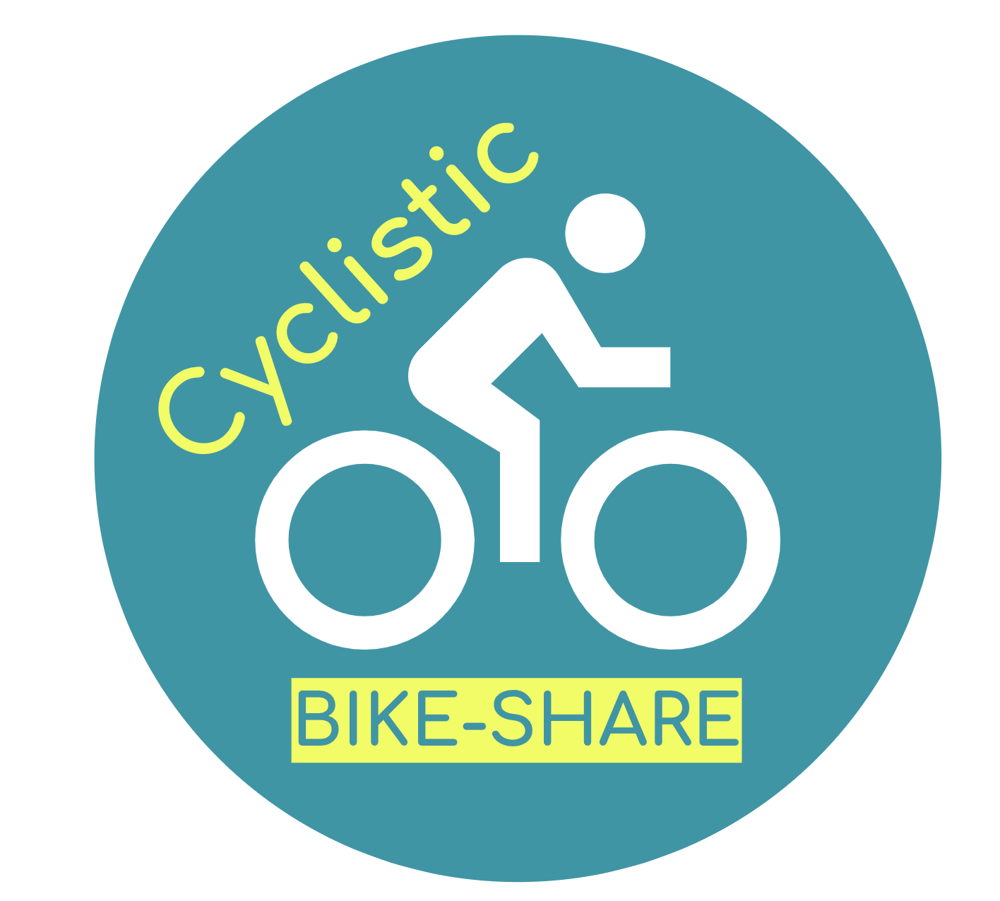
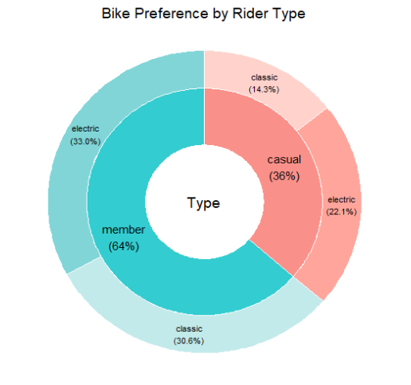

```{r setup, include=FALSE}
knitr::opts_chunk$set(echo = TRUE)
knitr::opts_chunk$set(warning = FALSE, message = FALSE)
```
<center>
<div style="width:300px; height:200px">

</div>
</center>

<br/>
<br/>
<br/>
<br/>

## Introduction
In this fictional scenario, I am working as a Junior Data Analyst for a bike sharing company called Cyclistic. Cyclistic owns a fleet of 5,824 bicycles that can be unlocked from one station and returned to any of their other 692 stations in Chicago. The bikes are geotracked, which allows the Cyclistic marketing team to analyse the purchasing behaviors of their customers.

You can view my code for each section of this analysis by clicking the show buttons or by selecting show all code at the top right hand corner.

<br/>

## Business Task
The marketing team director has decided that the company could generate more profit by maximizing it's number of annual members. She intends to shift the marketing focus to converting the current casual riders to annual members instead of generating new customers. Before developing a new marketing strategy, the team needs to better understand how annual members and casual riders differ, why casual riders would buy a membership, and how digital media could affect their marketing tactics.

**The marketing team director assigned me the first question to answer: How do annual members and casual riders use Cyclistic bikes differently?**

<br/>

## Data
The data used in this case study is publicly available and can be found [here](https://divvy-tripdata.s3.amazonaws.com/index.html). It is provided by Motivate International Inc. under this [license](https://divvybikes.com/data-license-agreement).

For the purposes of this analysis, data from the last twelve months (08/2022 - 07/2023) was downloaded as csv files. The data includes the the following variables:

- ride_id	

- rideable_type	(classic, docked, or electric bike)

- started_at (Date and time)

- ended_at (Date and Time)

- start_station_name	

- start_station_id	

- end_station_name

- end_station_id

- start_lat (Starting latitude)

- start_lng	(Starting longitude)

- end_lat	(Ending latitude)

- end_lng	(Ending longitude)

- member_casual (if the rider is a member or casually riding)

Data-privacy issues prohibit the use of riders' personally identifiable information so it is impossible to determine things such as if customers have purchased multiple single trip passes or their home location. 

<br/>

## Preprocessing
The data was first loaded into Rstudio and each of the 12 csv files were combined into one data frame. Since the data set is large, over 5,500,000 observations, a randomized sample of 20 percent of the data was generated to be used for analysis. This reduced the load time significantly. 

I noticed that the data had quite a few empty cells in the station name and station id columns, so I replaced these with NAs.

Next I checked for duplicate observations which were none. I removed any rides that lasted less than a minute long in duration because these rides were probably the result of issues with renting the bike and not actual trips. I noticed an observation that was 24 hours long, which might mean the user forgot to end their ride. I then removed rides that lasted over 10 hours to make sure that these instances were not included. Observations that had NA in the ride lenth column were also removed during this process. The day of the week for each ride was also derived using the wday() function from the Lubridate package.
```{r results = FALSE}
#install and load packages
pacman::p_load(readr, tidyverse, lubridate, hms, ggthemes, webr)

#load data
file_names = dir("./Data", full.names = TRUE) #get relative path of files in Data folder
trip_data = do.call(rbind,lapply(file_names, read.csv)) #combine all files together in on data frame

#take a sample percentage of the data
set.seed(1) #ensures the same results each time the following line of code is used 
trip_data_sample = sample_frac(trip_data, .2)

#convert from character to date format
trip_data_sample$started_at = ymd_hms(trip_data_sample$started_at)
trip_data_sample$ended_at = ymd_hms(trip_data_sample$ended_at)

#calculate the length of each ride
trip_data_sample$ride_length = as.period(trip_data_sample$ended_at - trip_data_sample$started_at)

#create new column for day of the week
trip_data_sample$week_day = 
  wday(trip_data_sample$started_at, label = TRUE)

#replace the empty cells for character variables with NA
trip_data_sample = trip_data_sample %>% 
  mutate(across(where(is.character), ~ na_if(.x, "")),)

#check for duplicate observations - none
sum(duplicated(trip_data_sample$ride_id))

#remove NAs and rides less than a minute and longer than 10 hours
trip_data_final = trip_data_sample %>% 
  filter(!is.na(ride_length)) %>% #removed 11 NAs
  filter(ride_length > "0M 59S") %>% #removed 30,285 observations
  filter(ride_length < "10H 0M 0S") #removed 1,730 observations


```
## Analysis
During the exploratory analysis of this study it was discovered that about 62 percent of the rides taken were by members. This makes sense as the members have already payed for the service.
Next, the ride lengths of each ride were calculated by subtracting the started_at time from the ended_at time. Casual riders ride the bikes for longer on average, especially on Friday, Saturday, Sunday, and Monday. The most used station for members is Kingsbury St & Kinzie St. From looking at Google maps, I saw that this station is located right next to a complex that is full of different business offices. The most visited station for casual riders is Streeter Dr & Grand Ave, which is right on the Navy Pier and looks very touristy.

```{r results = FALSE}
#Average ride length by members and casual riders individually
trip_data_final %>%
  group_by(member_casual) %>%
  summarise(avg_length = seconds_to_period(mean(period_to_seconds(ride_length))))

#Average ride length for users by day of the week
trip_data_final %>%
  group_by(week_day, member_casual) %>%
  summarise(avg_length = seconds_to_period(mean(period_to_seconds(ride_length))))

#Number of rides for users by day of the week
numb_week = trip_data_final %>% 
  group_by(member_casual, week_day) %>% 
  count()

#riders by time of day
num_hour = trip_data_final %>% 
  group_by(started_at = floor_date(started_at, '1 hour'), member_casual) %>%
  count()

num_hour$started_at = format(num_hour$started_at, format = "%H")

num_hour_final = num_hour %>% 
  group_by(started_at, member_casual) %>% 
  summarise(avg_hourly = mean(n))

#most rides taken by type of rider
trip_data_final %>% 
  group_by(member_casual) %>% 
  count()

#most popular docking locations by rider type

#for members
trip_data_final %>% 
  filter(member_casual != "casual") %>% 
  group_by(end_station_name) %>%
  na.omit() %>% 
  count() %>% 
  arrange(-n)

#for casual riders
trip_data_final %>% 
  filter(member_casual != "member") %>% 
  group_by(end_station_name) %>%
  na.omit() %>% 
  count() %>% 
  arrange(-n)


```

## Visualizations
I used a faceted line chart to view the distributions over time for both types of riders for each day of the week. The results demonstrate that for members there are two peaks on the week days; one in the morning around 8am and one in the afternoon around 5pm. For casual riders, there is a slight peak during the morning at the same time, but the more discernible peak is around 5pm, but with less of a drop afterwards than the members have. This suggests that the members are using the bikes to get to and from work, while the casual riders are using the bikes more for afternoon or free-time activities.
During the weekends, the rider types have similar usage trends, with the main time frame being in the afternoon from 11am - 8pm as well as more late night/early morning rides than during the week days.

<br/>
<br/>

```{r}
#line chart for times by each day

#group by member type, day of the week, and starting time by the hour
numb_day_time = trip_data_final %>% 
  group_by(member_casual, week_day, started_at = floor_date(started_at, '1 hour')) %>% 
  count()

#Convert starting time to just hourly
numb_day_time$started_at = format(numb_day_time$started_at, format = "%H")

#find hourly average by day and member type
numb_day_time = numb_day_time %>% 
  group_by(started_at, member_casual, week_day) %>% 
  summarise(avg_hourly = mean(n))

#facet line graph
ggplot(numb_day_time, aes(x = started_at, y = avg_hourly, group = member_casual, color = member_casual)) +                                     
  geom_line(linewidth = 1.2) +
  facet_wrap("week_day", nrow = 7)+
  scale_color_manual(values = c("#4095A5","#5AD2E8"), "Rider Type")+
  labs(x = "Hour", y = NULL, title = "Average Hourly Riders By Day of the Week")+
  theme_minimal()+
  theme(axis.text.y=element_blank())
```
<br/>
<br/>

The number of rides per day of the week by rider type is displayed below through a grouped bar chart. The data shows that members' usage of the bikes increases throughout the week days with a peak on Thursday. The behavior of the casual riders is completely the opposite, with rides decreasing through the work week and increasing on the weekends.

<br/>
<br/>

```{r}
#rides per day grouped bar chart
ggplot(numb_week, aes(fill = member_casual, y = n, x = week_day))+
  geom_bar(position = "dodge", stat = "identity")+
  scale_fill_manual("Rider Type", values = c("#4095A5","#5AD2E8"))+
  labs(x = "Day of the Week", y = NULL, title = "Number of Rides per Day")+
  theme_minimal()


```
<br/>
<br/>

Finally, the proportions of rides by type of bike are displayed through a doughnut chart. Both casual riders and members seem to prefer or at least have more access to electric bikes, especially casual riders. 

<br/>
<br/>

<div style="width:600px; height:400px">

</div>

```{r fig.show='hide'}
#bike type preference - doughnut chart

#create new df
doughnut = trip_data_final %>% 
  group_by(member_casual, rideable_type) %>% 
  rename(Type = member_casual) %>% 
  filter(rideable_type != "docked_bike") %>% #exclude docked_bike type
  count()

#rename bike types
doughnut$rideable_type[doughnut$rideable_type == "electric_bike"] <- "electric"
doughnut$rideable_type[doughnut$rideable_type == "classic_bike"] <- "classic"

PieDonut(doughnut, aes(Type, rideable_type, count=n),
         r0 = 0.45, r1 = 0.9,
         ratioByGroup = FALSE,
         title = "Bike Type Usage")


```

<br/>
<br/>
<br/>

## Recommendations
The results of this analysis suggest that casual riders don't use Cyclistic bikes to go to a 9-5 job like members might. Casual riders seem to use the bikes most frequently in the afternoon, particularly on the weekends. Also, the most frequented docking station for members is near many employers' offices, while the most used station for casual riders is in a touristy location. This might suggest that casual riders tend to be tourists while members are locals.

Casual users also ride the bikes for longer periods of time. This could suggest a few things. If the casual riders are tourists, it could show that they need more time to find their way around the city. If the casual riders are not tourists, it could hint that they live farther away from the city center, and therefore prefer to use faster or more comfortable modes of transportation. Or, casual riders may be locals, but don't not work 9-5 jobs like members. Students might make up a proportion of casual riders since they typically have less money to spend on memberships and often work afternoon and night time jobs such as in bars and restaurants. Further analysis could be done to investigate these possibilities.

Here are my top three recommendations to encourage casual riders to become members:

1. Create a membership deal specifically for people that want to use the bikes mainly on the weekends.

2. Create a short term membership deal for tourists, maybe week-long or weekend passes.

3. Offer student discounts on memberships. More analysis and data collection could be done to determine if a lot of casual riders are students.


